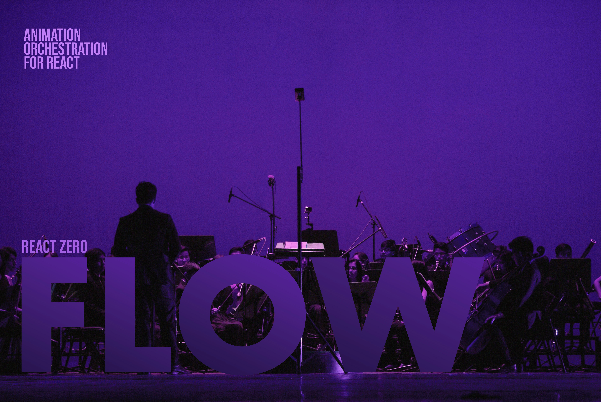

# @reactzero/flow

[](https://www.npmjs.com/package/@reactzero/flow)
[](https://bundlephobia.com/package/@reactzero/flow)
[](https://github.com/motiondesignlv/ReactZero-Flow/blob/main/LICENSE)
[](https://github.com/motiondesignlv/ReactZero-Flow/actions/workflows/ci.yml)



<sub>Photo by [Camy Aquino](https://www.pexels.com/photo/orchestra-performing-on-stage-5933199/)</sub>

Zero-dependency animation orchestration for React, powered by the Web Animations API.

## Why @reactzero/flow?

- **No React re-renders** -- animations run on the browser's compositor thread via WAAPI, not through React state
- **Deterministic sequencing** -- `sequence()`, `parallel()`, `stagger()` compose into predictable chains with no race conditions
- **Built-in adaptive degradation** -- the only animation library that automatically adjusts animations based on device capability and frame rate
- **True cancellation model** -- `finished` promises always resolve, never reject. Cancel any animation cleanly without try/catch
- **Tiny footprint** -- under 10KB gzipped with zero runtime dependencies

**How it compares:**

|  | Flow | Declarative libs | Imperative libs | CSS only |
|--|------|-----------------|-----------------|----------|
| Zero re-renders | Yes | No | No | Yes |
| Composable sequencing | Yes | No | Yes | No |
| Seekable timelines | Yes | No | Yes | No |
| React hooks API | Yes | Yes | No | No |
| Adaptive degradation | Yes | No | No | No |
| Under 10KB | Yes | No | No | Yes |

## Design Philosophy

1. **Composition over configuration** -- build complex choreography by combining simple primitives
2. **Animations are interruptible** -- every animation can be paused, cancelled, or reversed at any point
3. **Performance is first-class** -- automatic `will-change`, compositor detection, dev warnings, adaptive degradation
4. **Predictable, not magical** -- `finished` always resolves, `playState` is always accurate, no hidden state machines
5. **Everything is controllable** -- every primitive returns the same `Controllable` interface

## Features

- **Composable primitives** -- `sequence`, `parallel`, `stagger`, `delay` build complex choreography from simple steps
- **Full playback control** -- play, pause, cancel, and adjust playbackRate on any animation
- **Seekable timelines** -- scrub through position-based choreography with `timeline` and labels
- **Composition operators** -- `race`, `repeat`, `timeout` for advanced orchestration patterns
- **Scroll-driven animations** -- link animation progress to scroll position with `useScroll`
- **View Transitions** -- same-document transitions with `useViewTransition`
- **Performance-aware** -- automatic `will-change` management, dev warnings for layout-triggering properties, DevTools annotations
- **Adaptive performance** -- opt-in device tier detection, frame rate monitoring, and priority-based animation degradation
- **Reduced motion** -- built-in policy system (skip, reduce, crossfade, respect) at provider level
- **Type-safe** -- full TypeScript support with strict types for all APIs

## Quick Start

```bash
npm install @reactzero/flow
```

```tsx
import { useSequence, animate } from "@reactzero/flow";
import { useRef } from "react";

function App() {
  const box = useRef<HTMLDivElement>(null);
  const { play, state } = useSequence([
    () => animate(box.current!, [{ opacity: 0 }, { opacity: 1 }], { duration: 300 }),
    () => animate(box.current!, [{ transform: "scale(0.8)" }, { transform: "scale(1)" }], { duration: 200 }),
  ]);

  return (
    <div>
      <div ref={box} style={{ width: 100, height: 100, background: "#646cff" }} />
      <button onClick={play}>Play</button>
      <p>State: {state}</p>
    </div>
  );
}
```

## Core Functions

| Function | Description |
|----------|-------------|
| `animate(el, keyframes, options)` | WAAPI wrapper returning a `Controllable` |
| `sequence(...steps)` | Run steps one after another |
| `parallel(...steps)` | Run steps simultaneously |
| `stagger(targets, step, config)` | Staggered animation across elements |
| `delay(ms)` | Wait for a duration |
| `timeline()` | Seekable position-based choreography |

## React Hooks

| Hook | Description |
|------|-------------|
| `useSequence(steps, options?)` | Sequence playback with play/pause/cancel/state |
| `useStagger(targets, step, config?)` | Staggered animation across refs |
| `useTimeline(builder, options?)` | Seekable timeline with position control |
| `useScroll(options?)` | Scroll-linked animation progress |
| `useViewTransition()` | Same-document view transitions |
| `useReducedMotion()` | Detect prefers-reduced-motion preference |

## Composition Operators

| Operator | Description |
|----------|-------------|
| `race(...steps)` | First step to finish wins, others cancel |
| `repeat(step, options)` | Repeat a step N times or infinitely, with optional yoyo |
| `timeout(step, ms)` | Cancel a step if it exceeds a time limit |

## Scroll-Driven Animations

Uses native ScrollTimeline when available, with automatic fallback.

```tsx
import { useScroll } from "@reactzero/flow";

function ScrollProgress() {
  const { progress, ref } = useScroll({ axis: "block" });
  // progress: 0-1, updates reactively as user scrolls
  return <div ref={ref}>Scroll me ({Math.round(progress * 100)}%)</div>;
}
```

## View Transitions

```tsx
import { useViewTransition } from "@reactzero/flow";

function PageSwap() {
  const { startTransition } = useViewTransition();
  const navigate = () => startTransition(() => { /* update DOM */ });
  return <button onClick={navigate}>Navigate</button>;
}
```

## Reduced Motion

The built-in policy system respects user motion preferences at the provider level:

```tsx
import { ReducedMotionProvider } from "@reactzero/flow";

function App() {
  return (
    <ReducedMotionProvider mode="reduce">
      {/* All animations inside respect the policy */}
    </ReducedMotionProvider>
  );
}
```

Modes: `skip` (instant jump), `reduce` (faster playback), `crossfade` (opacity-only), `respect` (honor OS setting).

## Performance

Flow is built on the Web Animations API, which runs animations on the browser's compositor thread for GPU-accelerated performance. On top of that, Flow includes built-in performance features that work automatically.

| Metric | Value |
|--------|-------|
| React re-renders | 0 |
| Bundle size | ~8KB brotli |
| Dependencies | 0 |
| Rendering | GPU-accelerated via WAAPI |

### Automatic will-change

Flow automatically sets `will-change` on elements before animating compositor-tier properties (`transform`, `opacity`, `filter`), and removes it after the animation finishes. This eliminates first-frame jank by pre-promoting elements to GPU layers.

```tsx
animate(el, [{ transform: "scale(1)" }, { transform: "scale(1.5)" }], { duration: 300 })
// Automatically: el.style.willChange = "transform" → animation → el.style.willChange = "auto"
```

Opt out per-animation: `{ willChange: false }`.

### Development Warnings

In development, Flow warns when you animate layout-triggering properties and suggests GPU-friendly alternatives:

```
[flow] Animating layout properties may cause jank:
  width → transform: scaleX()
  top → transform: translateY()
```

| Tier | Properties | Performance |
|------|-----------|-------------|
| Compositor | `transform`, `opacity`, `filter` | GPU-accelerated, 60fps+ |
| Paint | `color`, `background-color`, `box-shadow` | Repaint only |
| Layout | `width`, `height`, `top`, `left`, `margin`, `padding` | Triggers reflow |

### Elastic & Bounce Easing

Use `linearEasing()` to sample math easing functions into CSS `linear()` strings, enabling elastic and bounce curves on the compositor thread:

```tsx
import { linearEasing, easeFn } from "@reactzero/flow";

animate(el, keyframes, { easing: linearEasing(easeFn.easeOutElastic) })
animate(el, keyframes, { easing: linearEasing(easeFn.easeOutBounce, 60) })
```

Check browser support with `supportsLinearEasing()`. Chrome 113+, Safari 17.2+.

### Performance Profiling

Make animations visible in Chrome DevTools Performance tab:

```tsx
import { setPerformanceAnnotations, animate } from "@reactzero/flow";

// Enable globally
setPerformanceAnnotations(true)

// Or per-animation
animate(el, keyframes, { duration: 300, __perf: true })
```

Creates `performance.mark/measure` entries like `flow:my-box:transform,opacity`.

### Native ScrollTimeline

`useScroll` automatically uses the native [ScrollTimeline API](https://developer.mozilla.org/en-US/docs/Web/API/ScrollTimeline) when available (Chrome 115+, Safari 18+), falling back to IntersectionObserver + scroll listeners in older browsers. No configuration needed.

### Adaptive Performance

Opt-in runtime performance adaptation. Enable with a single call:

```tsx
import { enableAdaptivePerformance, animate } from "@reactzero/flow";

// Detect device tier, start FPS monitoring, enable priority-based degradation
enableAdaptivePerformance();

// Tag animations with priority
animate(el, fadeIn, { duration: 300, priority: "critical" })    // always runs
animate(el, shimmer, { duration: 500, priority: "decorative" }) // skipped under pressure
```

When the frame rate drops below thresholds (45fps for decorative, 30fps for normal), the system automatically:
- **Skips** decorative animations (finish instantly)
- **Speeds up** normal animations (faster playback rate)
- **Preserves** critical animations (always run at full quality)

Detect hardware capability:
```tsx
import { detectDeviceTier } from "@reactzero/flow";
detectDeviceTier() // "high" | "medium" | "low"
```

### Smart Transform Decomposition

Opt-in conversion of layout properties to GPU-friendly transforms:

```tsx
// Before: animates `left` (triggers layout reflow)
animate(el, [{ left: "0px" }, { left: "100px" }], { duration: 300 })

// After: auto-converts to translateX (GPU-accelerated)
animate(el, [{ left: "0px" }, { left: "100px" }], { duration: 300, decompose: true })
```

Supported conversions: `left/right` to `translateX`, `top/bottom` to `translateY`, `width` to `scaleX`, `height` to `scaleY`.

## Testing Animations

Flow's `finished` promise and `duration: 0` pattern make animations easy to test without timers:

```tsx
// Instant animation — no fake timers needed
await animate(el, keyframes, { duration: 0 }).finished;

// Test a full sequence
const ctrl = sequence(
  () => animate(el, fadeIn, { duration: 0 }),
  () => animate(el, slideUp, { duration: 0 }),
);
ctrl.play();
await ctrl.finished;
expect(el.style.opacity).toBe("1");
```

## Browser Support

| Browser | Minimum Version |
|---------|----------------|
| Chrome  | 75+ |
| Firefox | 75+ |
| Safari  | 13.1+ |
| Edge    | 79+ |

Requires the Web Animations API (`Element.animate()`), supported in all modern browsers.

## Documentation

Full documentation, guides, and interactive examples:

[https://motiondesignlv.github.io/ReactZero-Flow/](https://motiondesignlv.github.io/ReactZero-Flow/)

## Contributing

Contributions are welcome. Please open an issue first to discuss changes before submitting a pull request.

## Author

Built and maintained by [@motiondesignlv](https://github.com/motiondesignlv)

## License

[MIT](./LICENSE)
